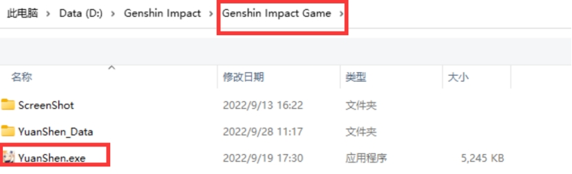
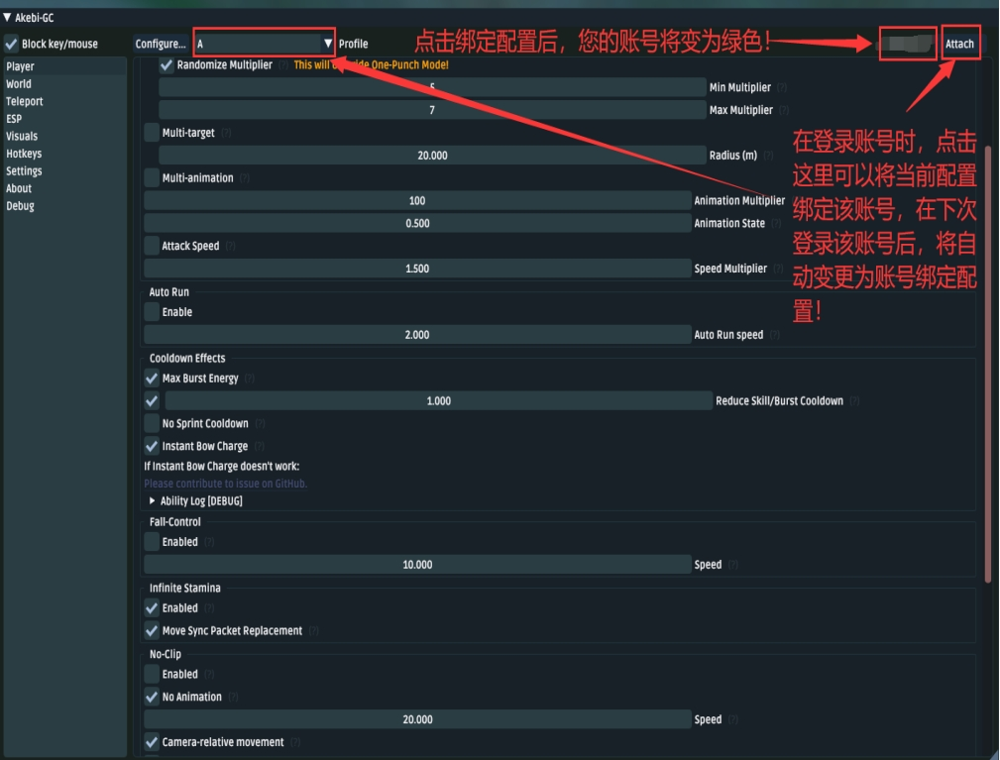
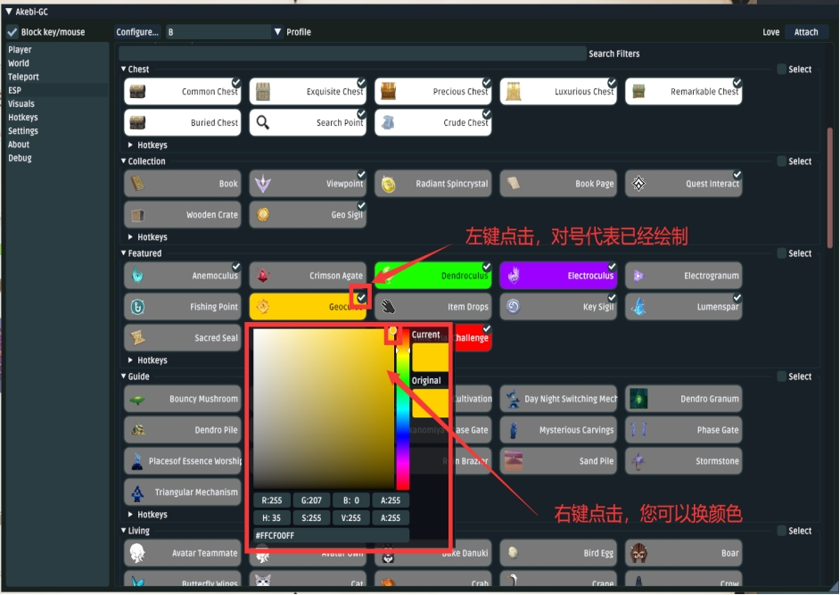
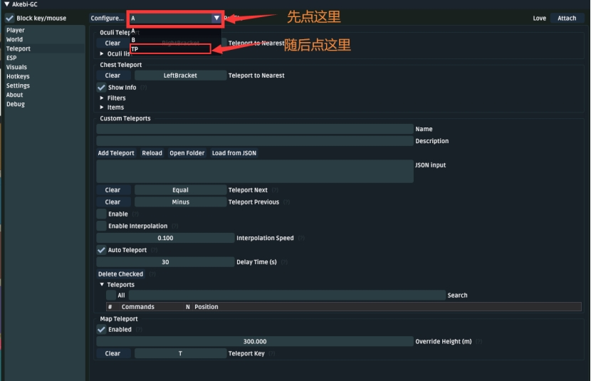
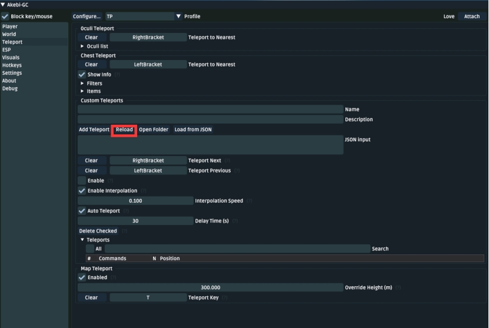
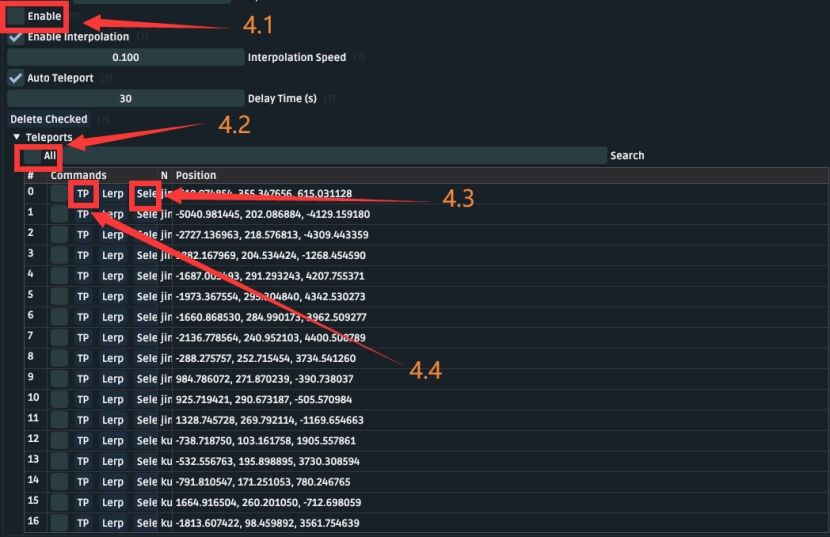

# 使用指南

## **优雅的邂逅**

1.解压Akebi的文件夹到**非原神根目录非桌面**非中文**的任意文件夹（您下次最好可以找的到）

2.解压Akebi本体（您自行下载的）到您刚刚解压的“Akebi”目录下

3.在关闭原神的情况下，双击打开(需要管理员权限)injector.exe

4.选择**Yuanshen.exe**的文件

			**一般在原神的安装文件夹的Genshin Impact Game文件夹下**

5.选择后将自动进入游戏，等到登录界面时，将会自动显示Akebi的功能界面，后续进入游戏只需要启动injector.exe，您可以将injector.exe加入开始界面或者将其创建**快捷方式**后移动至桌面，它可以很好的代理原神启动器！

Ps：在您进入游戏后，您的UID和名字会被默认配置文件修改，无须担心，这只是一个显示页面上的改变，并不是真正的修改您的信息，这样的初衷是为了让您更加优雅自如的进行游戏内的截图分享操作，如果您不需要，仅需在Visuals中关闭下图中框选的选项即可。

美妙的重逢

当原神更新后，您与Akebi将会迎来短暂的离别，但离别是为了更美妙的重逢。

下载最新版Akebi本体后，您可以直接进行**邂逅**的第二步，唯一多出来的步骤就是要覆盖。

## 配置文件

### **配置文件及功能介绍**

**A配置**

**大号**使用

配置功能介绍：

**多重攻击** 5-7倍随机倍数

**拾取范围增加（**5m**）**

**自动拾取**、**自动宝箱**（**随机时间250ms+350ms**）**

**飞天**20倍加速（减速10倍）

**无限E/Q**

**无限体力**拦截包发包模式

**ESP**默认显示

**剧情加速**5

**加速烹饪、快速精通烹饪**

**自动砍树**（350ms攻击延时、500ms重复延时、每棵树攻击次数2、范围5m）

**自动钓鱼**（拉杆延时2200重杆延时800）

**自动爆矿**、**自动爆植物**(蒲公英等)、**自动摧毁木箱子**（距离5m）

**自动挑战、炸药桶自动爆炸（**8m，延时2000ms**）**

**FPS显示**、**传送目标显示**（ocull为神瞳、chest为宝箱）

**B配置**

**小号**使用

功能介绍：

**多重攻击** 一刀秒杀

**自动拾取**、**自动宝箱**（**随机时间450ms+500ms**）**

**飞天**20倍加速（减速10倍）

**无限E/Q**

**无限体力**拦截包发包模式

**ESP**默认显示

**剧情加速**5

**加速烹饪、快速精通烹饪**

**自动砍树**（300ms攻击延时、500ms重复延时、每棵树攻击次数3、范围10m）

**自动钓鱼**（拉杆延时2000重杆延时500）

**自动爆矿**、**自动爆植物**(蒲公英等)、**自动摧毁木箱子**（距离8m）

**自动挑战、炸药桶自动爆炸（**20m，延时2000ms**）**

**FPS显示**、**传送目标显示**（ocull为神瞳、chest为宝箱）

**TP**配置**

**自动**传送**使用

功能介绍：

**自动传送**默认间隔30秒

**飞天穿墙**默认开启，无法通过快捷键关闭

**拾取范围**20m

**自动拾取**、**自动宝箱**（**随机时间450ms+500ms**）**

**无敌**

**
**

### **配置文件的切换与绑定**

#### 配置文件的切换

开启辅助后在**功能界面的左上方**切换配置（默认配置是A，您应该可以找到A这个字母）

#### 配置文件的绑定

如果您不想每一次上号都进行一次切换配置，那么您可以对配置文件进行绑定

### **快捷键的寻梦之路**

**F1**				打开辅助功能界面

**[**				传送至离您最近的宝箱地点

**]**				传送至离您最近的神瞳地点

**+**				传送至下一个json数据地点（不会用看自动传送使用教程）

**-**				传送至上一个json数据地点（不会用看自动传送使用教程）

**T长按+鼠标左**	大地图定点传送

**鼠标侧下**		开启飞天加速

**长按鼠标侧上**	降低飞天加速速度

当然，您可以通过**Hotkeys**功能自定义配置您的快捷键！

### **ESP的视觉盛宴**

我对ESP做了一些基础的配置让一些物品的展示得以有鲜明的颜色。

如果您想要修改，可以参考下面的图片进行绘制物品的增加或减少。

## **Akebi的不归旅途**

### 自动传送的食用方法

1.进入Akebi的teleports文件夹下，找到您想要进行自动传送的物品（这里以晶核为例）

2.将晶核的文件夹中的json一堆文件都搞到teleports文件夹中

3.回到游戏，打开辅助功能界面，切换为TP的配置文件(重要)

4.点击传送（Teleport）的下的重新加载（Reload）按钮

4.1勾选自动传送的开启按钮（Enable）

4.2勾选自动传送（Auto **Teleports**）下的**All**

4.3随后点击第0个传送点的选择按钮（Select）

4.4紧接着点击传送（TP），随后关闭界面等待就好。

5.关闭功能显示页开始挂机完成后记得更换会原来的配置！（重要）

### **交互式地图点位的奇妙体验**

按下m打开地图后，会看到有两个菜单：**interactive map**和**Filters**

其中**interactive**我已经**配置完成，**您只需要像调整**ESP**一样调整**Filters**就可以在您的地图上标记相应资源的点位！

**右键**可以将点位**变成半透明**.表示已经去过该点位！

> 本文作者:Discord：**SDK-China#5338**
